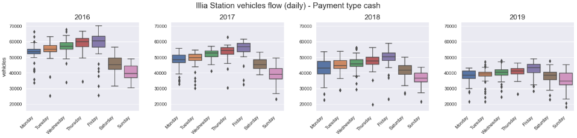
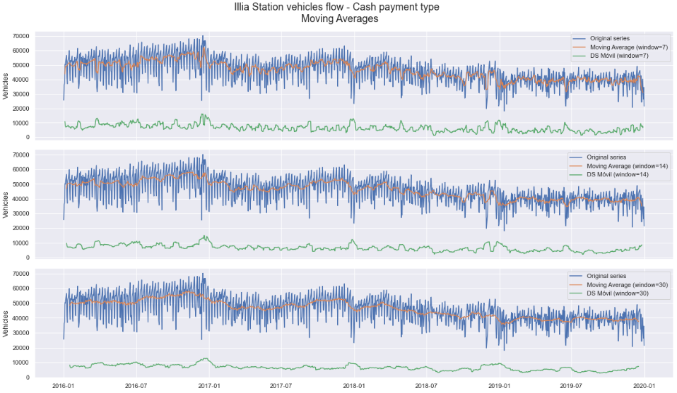
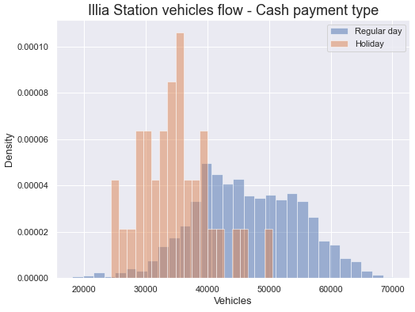

## Buenos Aires Traffic Forecasting 

### Project Overview
* Analysed Buenos Aires 'Illia Highway' Toll Station data and produced a forecasting model for it's traffic flow using an XGBoost Regressor (RMSE=4540).
* Tested and optimized Random Forest and Gradient Boosting Regressors using GridsearchCV to reach the best model.
* Time Series, Series decomposition and Statistis analysis.
* Analyzed models errors, feature importances and residuals.

### Code and Resources Used 
**Python Version:** 3.7  
**Packages:** numpy, pandas, sklearn, matplotlib, seaborn, statsmodels.

### Dataset
The original yearly datasets are taken from the Autonomous City of Buenos Aires Government web and contains information of all highways toll stations that connect with the city.      
Data from years 2016 to 2019 was downloaded and a subset with only the data from 'Illia Highway' for type of payment 'cash' was built.  
Dataset: https://data.buenosaires.gob.ar/dataset/flujo-vehicular-por-unidades-de-peaje-ausa.  

### EDA
* Data time evolution and grouped distributions analysis.
* Outliers analysis and filtering.
* Stationarity, seasonality and autocorrelation analysis.
* Series decomposition.
* Feature engineering.

Below are notebook captures as examples of our analysis:

### Data Preparation
A Time Series with the toll station car passes data during the four years was built and used to construct a Dataframe with 3 months (90 days) lags per instance/date. Seven features created in the EDA section were added ending up with a Dataframe with 1370 instances (rows) and 97 features (columns). 
Data was splited into train (75%) and test (25%) sets.

### Models Building and Performance
Random Forest and Extreme Gradient Boosting Regressors models were developed and tuned using GridSearch. 

* **Random Forest Regressor**: RMSE=4691. 
* **XGBoost Regressor**: RMSE=4540.

### Metric Chosen
* **RMSE (Root Mean Squared Error)**: measures the Standard Deviation of residual values (differences between predicted and real values).  
    Reasons for the choise:    
    - Uses the same scale as the target variable "Price" (that's why we chose it instead of MSE).
    - It's easily differentiable, what makes it easy to use in conjunction with derivative-based methods like gradient descent (that's why we chose it instead of MAE).

